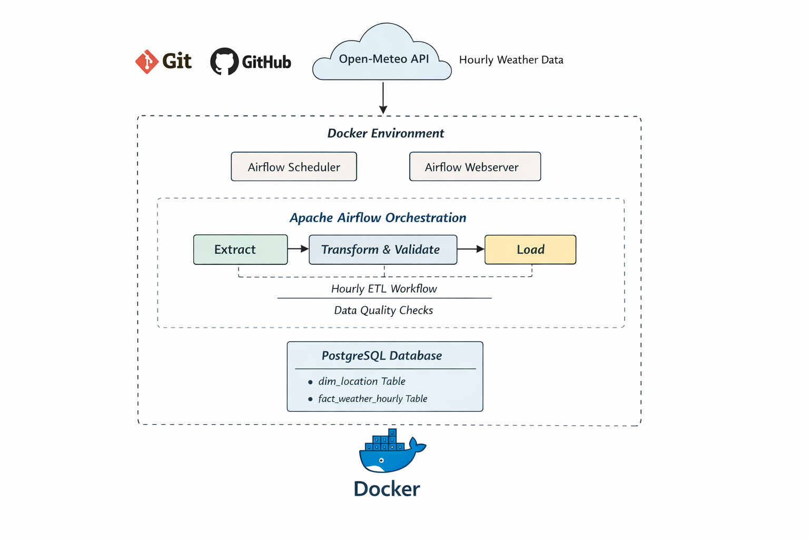

## Global Weather Analytics Pipeline

This project involves building an automated weather data pipeline that collects hourly data from a public API, transforms and cleans it to ensure reliability, and stores it in a PostgreSQL database for efficient querying. The pipeline will be orchestrated using Apache Airflow, incorporating robust data quality checks, comprehensive logging, and error handling to maintain reliability and traceability. The entire project will be version-controlled with Git and GitHub, with Docker for containerization, ensuring consistent environments, simplified deployment, and seamless integration between services such as Airflow and PostgreSQL.
## Architecture Overview




## Data source

- Open-Meteo API

## Pipeline Features

- Hourly extraction of weather data from Open-Meteo API

- Transformation: clean, enrich, create derived columns (heat_index,    comfort_level, is_raining)

- Loading into PostgreSQL with dimension & fact tables.

- Automated Airflow DAG for orchestration

- Logging and retry mechanisms for reliability

- Data quality checks (validate temperature, humidity, timestamps)

- Version control with Git/GitHub

- CI/CD for testing and linting

## Folder 

```
weather-data-engineering/
├── airflow/
│ ├── dags/
│ │ ├── utils/
│ │ │ ├── data_quality.py
│ │ │ ├── db.py
│ │ │ ├── extract.py
│ │ │ ├── load.py
│ │ │ ├── logger.py
│ │ │ └── transform.py
│ │ └── weather_pipeline_dag.py
│ ├── logs/
│ └── plugins/
├── sql/
│ └── Hourly_Weather.sql
├── Images/
├      └──Architecture_Diagram.png 
├── .env
├── docker-compose.yaml
├── .gitignore
├── README.md
└── requirements.txt
```


## Understanding and Exploring choice API

Open-Meteo API

- Public, free, no API key
- Provides hourly weather forecasts and historical data

Interested Fields:
- time → timestamp (hourly)
- temperature_2m
- relativehumidity_2m
- windspeed_10m
- Weather condition / precipitation (for rain logic)

Why we pick these:

They are numerical, time-based, and perfect for analytics

They allow us to:

- Calculate heat index
- Classify comfort level
- Detect rain conditions

### Understanding the API Response Shape


The API response is:

- JSON
- Nested
    Hourly data comes as:

    -One array of timestamps
    -Multiple arrays of values (same length)


This is NOT immediately usable in a database and therefore helps in

- Normalization process
- Turn it into rows

This informs the design of extract & transform logic


### Identify Possible Data Issues

We must assume the data can be imperfect.

Potential problems:

- Missing timestamps
- Null values in temperature or humidity
- Unrealistic values (e.g., humidity > 100)
- API downtime or slow responses
- Partial responses

This is crucial and directly helps to inform:

- Data quality checks
- Error handling
- Retry logic.

Deciding on What “Good Data” Means (Data Contracts)


basic data expectations:

- Timestamp must exist
- Temperature must be between −50°C and 60°C
- Humidity must be between 0 and 100
- Wind speed must be ≥ 0
- Each hourly record must align across fields


## Deciding on What is to be Stored vs What is to be Derive

Raw fields from API:
- time
- temperature
- humidity
- windspeed
  
Derived fields (computed later):
- heat_index
- comfort_level
- is_raining

## What ETL Really Means 

## Extract

Getting data as-is from the source

### Decide Responsibilities for Each Layer

Extract Layer (utils/extract.py)

 - Call Open-Meteo API
 - Handle network issues (timeouts, retries)
 - Log success/failure


### Transform Layer (utils/transform.py)

 - Standardize timestamps
 - Handle missing values

Calculate:

- heat_index
- comfort_level
- is_raining

Apply data quality checks:

- value ranges
- null checks
- Log number of valid vs invalid rows


Load Layer (utils/load.py)

- Insert data into:
- dim_location
- fact_weather_hourly
- Enforce foreign key logic
- Avoid duplicates (idempotency)
- Log number of rows inserted


## Deciding Where Data Quality Lives

We enforce quality in two places:

1️. Transform Layer

- Business rules
- Value ranges
- Null checks
- Logical consistency

2️. Database Layer

- Schema constraints
- Foreign keys
- Data types


## Plan Error Handling & Retries

### Extract Phase

- Retry API calls (network issues)
- Fail loudly after max retries

### Transform Phase

- Drop or quarantine bad rows
- Fail pipeline if quality threshold breached

### Load Phase

- Roll back on failure
- Prevent partial writes


## How to Run

How to Run the Project
### Prerequisites

Ensure you have the following installed:

- Docker

- Docker Compose

- Git

## Clone the Repository
clone the repo into your local machine

## Configure Environment Variables

Create a .env file in the root directory and add:

- DB_USER=your_db_user
- DB_PASSWORD=your_db_password
- DB_NAME=your_db_name


## Start All Services with Docker
docker-compose up --build


This will start:

- Airflow Webserver

- Airflow Scheduler

- PostgreSQL Database

## Access Airflow UI

Open your browser and go to:

http://localhost:8080


Login with your Airflow credentials.

## Trigger the DAG

- Locate weather_pipeline_dag

- Enable the DAG

- Trigger manually or wait for scheduled run

## Stop the Services

To stop all containers:

## Further Enhancements.

    - CI/CD, dashboards, etc


